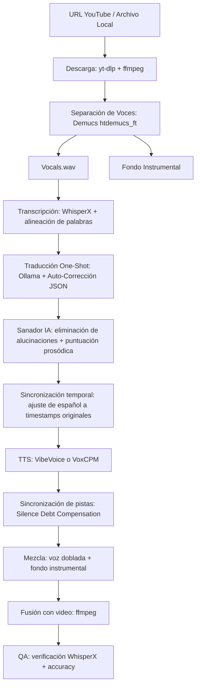

# JANUS Audio Editor / AI Video Dubber (v4.1)

Este proyecto es una aplicación web local para **traducir, doblar y editar** videos de YouTube de forma automatizada desde y hacia múltiples idiomas (Español, Inglés, Japonés, Portugués, Francés, Alemán, Italiano, Coreano, Chino). Combina transcripción (WhisperX), traducción local (Ollama), síntesis de voz (VibeVoice / VoxCPM) y edición no-lineal en un estudio interactivo, orquestado bajo una arquitectura optimizada para Windows/WSL con GPUs NVIDIA.

---

## Pipeline



### Componentes

1. **Separación (Demucs via UVR5-UI)**: Extrae voz y fondo instrumental por separado. Usa el modelo `htdemucs_ft`.

2. **Transcripción (WhisperX)**: Reconocimiento de voz multilingüe con timestamps a nivel de palabra mediante alineación forzada (wav2vec2). Soporta inglés, español, japonés, portugués, francés, alemán, italiano, coreano y chino.

3. **Traducción (Ollama)**: Traducción one-shot multilingüe con auto-corrección JSON (hasta 5 reintentos). Soporta cualquier par de idiomas (X→Español o X→Inglés).

4. **Sanador IA**: Capa post-traducción que elimina alucinaciones, agrega puntuación prosódica (!, ?) y corrige repeticiones.

5. **Sincronización Temporal**: Ajusta el español traducido a los timestamps originales usando alineación proporcional.

6. **TTS (`VibeVoice` o `VoxCPM`)**: Configuración automática vía script de setup (`services/`). Generación distribuida en servidores paralelos (múltiples puertos) para evitar colisiones de VRAM. Soporta clonación zero-shot de voz.

7. **Mezcla y Fusión**: Combina voz doblada con fondo instrumental a -1dB y ensambla el video final.

---

## Interactive Studio Editor (v3.0)

Editor no-lineal integrado en la web para corrección quirúrgica post-procesamiento:

- **Timeline horizontal**: Bloques de colores para Video, Audio Original (inglés) y Audio Doblado (español).
- **Regeneración por bloque**: Seleccioná un bloque, corregí el texto en el Inspector y regenerá solo ese MP3 (~5s).
- **Auditoría en tiempo real**: Escuchá el canal vocal original aislado vs el doblado.
- **Ensamblaje instantáneo**: Reconstruye el video final con los bloques corregidos sin reprocesar todo.

---

## Requisitos

### Sistema
- Python 3.10+
- FFmpeg (se descarga automáticamente en el setup; no requiere instalación manual)
- Ollama corriendo localmente (puerto `11434`)
- GPU NVIDIA con CUDA (probado en RTX 5070, CUDA 12.8)
- Windows (nativo) o WSL con Ubuntu

### Configuración
Copiá `backend/.env.example` a `backend/.env` y ajustá las variables (modelos, puertos TTS, rutas FFmpeg, etc.).

### Dependencias Python
```
fastapi==0.111.0
uvicorn==0.30.1
yt-dlp>=2026.6.9
pydub==0.25.1
requests==2.32.3
```

---

## Instalación

El script de setup (`setup_env.bat` en Windows, `setup.sh` en Linux/WSL) automatiza todo el entorno:
- Clona repositorios externos (`VibeVoice`, `VoxCPM`, `Demucs`) en la carpeta `services/`
- Crea entornos virtuales Python (`venv`) para cada servicio
- Descarga los pesos de los modelos necesarios

1. **Windows**:
   ```cmd
   setup_env.bat
   ```

2. **Linux / WSL**:
   ```bash
   ./setup.sh
   ```

3. **Servidores TTS**: El script de setup configura automáticamente VibeVoice y/o VoxCPM en `services/` con sus entornos Python y modelos. No se requiere configuración manual.

---

## Inicio

### Windows
```cmd
run.bat
```

### WSL / Linux
```bash
./run.sh
```

Servidor en **http://localhost:8000**

---

## API Endpoints

| Endpoint | Método | Descripción |
|----------|--------|-------------|
| `/api/upload` | POST | Subir video local (.mp4) |
| `/api/process` | POST | Iniciar procesamiento (URL o caché) |
| `/api/cancel/{id}` | POST | Cancelar tarea |
| `/api/status/{id}` | GET | Estado y progreso de tarea |
| `/api/models` | GET | Listar modelos Ollama disponibles |
| `/api/stream/{id}` | GET | Video doblado (HTTP 206 Partial Content) |
| `/api/caches` | GET | Listar tareas cacheadas |
| `/api/studio/{id}/data` | GET | Datos del estudio interactivo |
| `/api/studio/{id}/reprocess` | POST | Regenerar bloque del estudio |
| `/api/studio/{id}/finalize` | POST | Ensamblar video final |

---

## Interfaz Web

- Diseño glassmorphism oscuro con acentos neón
- Reproductor con subtítulos sincronizados (inglés/español)
- Panel de timers con barras de progreso por etapa
- Selector inteligente de modelos Ollama
- Simulador de caché para depuración
- Selector de idioma original y destino (Español/Inglés)
- Studio Editor con timeline interactivo

---

## Notas técnicas

- **VRAM**: Los servidores TTS se levantan y destruyen dinámicamente para liberar memoria.
- **WSL**: El backend detecta `os.name` y usa `wsl_to_windows_path()` o rutas nativas según corresponda.
- **Caché idempotente**: Cada etapa guarda resultados en `cache/{task_id}/`; si se interrumpe, retoma desde el último paso completo.
- **FFmpeg**: El setup descarga una versión portable en `backend/bin/`. No requiere instalación manual. Si ya tenés ffmpeg, podés forzar su uso vía `FFMPEG_PATH` en `backend/.env`.
- **Servicios externos**: VibeVoice, VoxCPM y Demucs son clonados automáticamente por el script de setup en `services/`. No se requieren symlinks ni configuración manual.

---

## Documentación del proyecto

Este repositorio contiene varios archivos `.md` con propósitos específicos. Esta sección es para que una IA (u otro desarrollador) entienda rápidamente qué contiene cada uno y cuándo consultarlos.

| Archivo | Propósito |
|---------|-----------|
| `README.md` | Documentación principal para el usuario: descripción, instalación, uso, API, features. Punto de entrada del proyecto. |
| `implementation_plan.md` | Plan de implementación técnica: estado actual del desarrollo, migraciones pendientes (VoxCPM, uv), correcciones planificadas. Orientado a desarrolladores e IA. |
| `deployment_plan.md` | Plan de despliegue a producción: Docker, portabilidad cloud, variables de entorno, submodules. Para cuando el proyecto se mueva a un servidor. |
| `debugagent.md` | Contexto de debugging para agentes IA: historial de errores resueltos, arquitectura clave, sistema de caché. Consultar cuando se reporte un error en ejecución. |
| `benchmark_report.md` | Reporte de rendimiento comparativo entre VibeVoice y VoxCPM en diferentes escenarios (con/sin clonación, one-shot/frase, paralelo/secuencial). |

### Carpeta `debugs/`

Scripts de test automatizados para verificar la integridad del código sin necesidad de ejecutar el pipeline completo. Ejecutables con Python estándar — no requieren GPU ni Ollama.

| Script | Propósito |
|--------|-----------|
| `test_language_chain.py` | Verifica que la cadena completa del selector de idiomas V4.0 (frontend → API → WhisperX → traductor) esté correctamente cableada. Chequea que no haya hardcodes de `language="English"`, que los parámetros fluyan desde `ProcessRequest` hasta los prompts de traducción, y simula la conversión de nombres de idioma a códigos ISO (`Japanese` → `ja`). |

Ejecución:
```bash
python3 debugs/test_language_chain.py
```

Agregar nuevos tests a esta carpeta cuando se implementen features críticas que deban validarse antes de deploy.

### Carpeta `backend/whisperx_models/`

Modelos de alineación de palabras (wav2vec2) para WhisperX, descargados localmente al proyecto. **No dependen del cache de HuggingFace** — se descargan una vez y se referencian con rutas absolutas.

```
backend/whisperx_models/
└── align/
    └── ja/   ← wav2vec2-large-xlsr-53-japanese (1.2 GB)
    └── zh/   ← (pendiente descarga)
    └── ko/   ← (pendiente descarga)
```

Para agregar un nuevo idioma:
```bash
# Desde WSL:
python3 -c "
from huggingface_hub import snapshot_download
snapshot_download('jonatasgrosman/wav2vec2-large-xlsr-53-japanese', local_dir='backend/whisperx_models/align/ja')
"
```

Los modelos se referencian automáticamente desde `whisper_client.py` (sin hardcodear rutas de HF cache).

### Flujo de consulta recomendado para una IA

1. Leer `README.md` para entender el proyecto, el pipeline y cómo se instala.
2. Leer `implementation_plan.md` para conocer el estado del desarrollo y qué falta implementar.
3. Si hay un error en tiempo de ejecución, leer `debugagent.md` para contexto de debugging.
4. Si se planea desplegar, leer `deployment_plan.md`.
5. Si se necesita comparar motores TTS, leer `benchmark_report.md`.

Los planes de implementación pendientes se encuentran en `implementation_plan.md`, no en este archivo.

---

## Subproyectos

Este repositorio contiene subproyectos con su propia lógica y documentación:

| Subproyecto | Carpeta | Descripción |
|-------------|---------|-------------|
| **JANUS Studio Editor** | `editor/` | Editor interactivo no-lineal para corrección de videos doblados. Frontend en `frontend_studio/`. |

Cada subproyecto tiene su propio `README.md` con documentación, arquitectura, plan de implementación y bugs conocidos. Consultar la carpeta correspondiente para más detalles.


