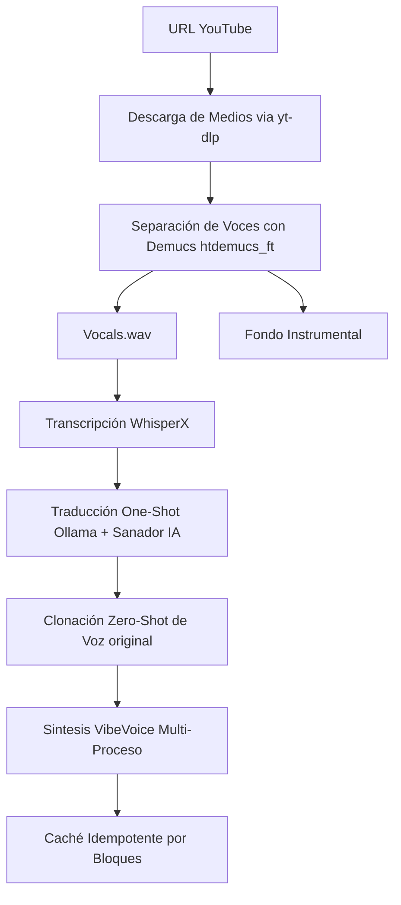

# 🎬 AEGIS Audio Editor / AI Video Dubber (v3.0)

Este proyecto es una aplicación web local de nivel premium diseñada para **traducir, doblar y editar** videos de YouTube al español de forma automatizada. Combina modelos avanzados de transcripción, traducción local/nube y síntesis de voz, orquestados bajo una arquitectura no lineal que te permite editar audio a nivel de bloque en un Estudio Interactivo profesional.

---

## 🧠 Arquitectura y Flujo del Pipeline (v3.0)

El sistema opera bajo dos modalidades: el modo de Procesamiento en Lote (One-Shot Pipeline) y el modo de Edición Interactiva (Studio Mode).

### 1. El Motor de Pipeline Automatizado


### Componentes Clave del Motor:

1. **Separación de Audio (Demucs)**:
   - Extrae la voz limpia y el fondo musical preservando el diseño de sonido del creador a -1dB.
2. **Transcripción (WhisperX)**:
   - Provee transcripción ultra precisa con marcas de tiempo a nivel de palabra mediante alineación forzada.
3. **El Sanador (Anti-Colapso IA)**:
   - Una capa automatizada post-traducción que intercepta el guion y elimina alucinaciones de texto antes de enviarlas al TTS, inyectando puntuación teatral (!, ?) para guiar la emoción prosódica de VibeVoice bajo un escudo estructural matemático de índices de tiempo.
4. **Motor VibeVoice Multi-Proceso**:
   - Generación distribuida en múltiples procesos independientes (`8001`, `8002`, etc.) según la VRAM disponible, garantizando 0 colisiones en PyTorch y evitando *silencios o repeticiones robóticas*.
5. **Caché Idempotente Total**: 
   - El sistema guarda los archivos JSON y Audios de cada etapa. Si detienes la tarea o modificas algo, el sistema omitirá los pasos previos cargando los resultados calculados en 0.001 segundos.

---

## ✂️ Interactive Studio Editor (NUEVO en v3.0)

Se ha implementado un Editor No-Lineal Profesional integrado en la web. Tras un procesamiento base, puedes abrir el Estudio y disfrutar de:
- **Timeline Horizontal Interactivo**: Una línea de tiempo con bloques de colores estilo neón para Video, Audio Original (Inglés) y Audio Doblado (Español).
- **Procesamiento Aislado por Bloque**: ¿La IA cometió un error fonético en el minuto 45? Selecciona ese bloque en la línea de tiempo, escribe la corrección en el Inspector, y presiona "Regenerar Audio". El servidor regenerará **solo ese archivo mp3 en 5 segundos**, evitando reprocesar todo el video de 1 hora.
- **Auditoría de Audio en Tiempo Real**: Botones dedicados para escuchar el canal vocal original aislado vs el canal vocal doblado, recortados en milisegundos con `pydub`.
- **Ensamblaje Instantáneo**: Un botón mágico borra el cache de video para forzar al caché idempotente a reconectar los nuevos audios arreglados de forma instantánea al pulsar Traducir (Caché).

---

## 🛠️ Requisitos e Instalación

### Requisitos Previos (Windows Host / WSL)
- Python 3.10 o superior.
- **FFmpeg** instalado.
- **Ollama** instalado y corriendo localmente (puerto `11434`).
- **NVIDIA GPU** con capacidad para procesos paralelos PyTorch.

### Configuración del Entorno

1. **Clonar el repositorio**:
   ```bash
   git clone https://github.com/jonnyck-dev/TRADUCTOR.git
   cd TRADUCTOR
   ```

2. **Crear enlaces simbólicos (Windows)**:
   Abre cmd como Administrador:
   ```cmd
   setup_symlinks.bat
   ```

3. **Instalar dependencias**:
   ```cmd
   setup_env.bat
   ```

---

## 🚀 Cómo Iniciar el Proyecto

### En Windows
Haz doble clic en `run.bat` o desde terminal:
```cmd
run.bat
```

### En WSL / Linux
```bash
./run.sh
```

El servidor web premium estará disponible en: **👉 [http://localhost:8000](http://localhost:8000)**

---

## 🎨 Características de la Interfaz Web (Glassmorphism UI)

- **Diseño Premium v3.0**: Interfaz oscura `Dark Mode` con acentos de color neón interactivos.
- **Web-Streaming Integrado (HTTP 206 Partial Content)**: El motor de FastAPI soporta carga dinámica de video, permitiendo adelantar y retrasar la barra del reproductor multimedia en tu navegador libremente sin recargar el caché.
- **Timers y Análisis de Rendimiento**: Un panel visual detalla los segundos y el porcentaje invertido por tu GPU/CPU en cada paso del proceso (Descarga, Demucs, WhisperX, Traducción, TTS).
- **Selector Inteligente de Modelos Ollama**: Agrupa visualmente modelos en tiempo real.
