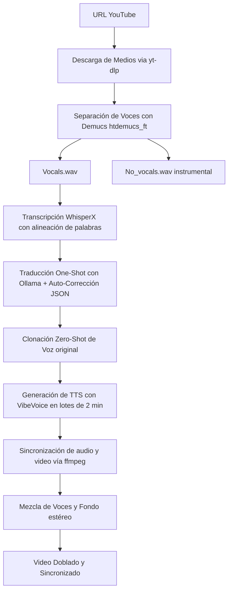

# 🎬 AI Video Dubber & Translator (Premium)

Este proyecto es una aplicación web local de nivel premium diseñada para **traducir y doblar videos de YouTube** al español de forma automatizada. Combina modelos avanzados de transcripción, traducción local/nube y síntesis de voz, todo orquestado bajo un flujo optimizado que protege el uso de VRAM y CPU en sistemas Windows/WSL con tarjetas gráficas NVIDIA (probado en RTX 5070 con CUDA 12.8).

---

## 🧠 Arquitectura y Flujo del Pipeline

El doblador de voz opera en un pipeline secuencial optimizado que mide y expone los tiempos de ejecución de cada fase en la interfaz:



### Componentes Clave:

1. **Separación de Audio (Demucs)**:
   - Extrae la voz limpia (`vocals.wav`) para evitar alucinaciones en la transcripción.
   - Extrae el fondo instrumental, música y efectos (`no_vocals.wav`) mediante la mezcla estéreo de Bass, Drums y Other a -3dB.
2. **Transcripción (WhisperX)**:
   - Provee transcripción ultra precisa con marcas de tiempo a nivel de palabra mediante alineación forzada (wav2vec2).
3. **Traducción Inteligente (Ollama)**:
   - Ejecución en **modo One-Shot exclusivo** optimizando el contexto enviando solo textos y marcas básicas de tiempo (reduciendo ~70% de tokens redundantes).
   - **Corrección regex integrada (`fix_json_quotes`)**: Repara comillas dobles internas y comas omitidas antes del parser.
   - **Auto-corrección iterativa (hasta 5 intentos)**: Captura fallos de sintaxis JSON y le pide a la IA que se corrija pasándole la traza del error.
4. **Síntesis y Doblaje (VibeVoice)**:
   - **Clonación de Voz Zero-Shot**: Extrae automáticamente una muestra de 1 minuto de la voz original del video y la usa para sintetizar el español.
   - **Slicing de 2 Minutos**: Segmenta el audio para evitar que el generador autoregresivo de VibeVoice degrade o alucine el habla.
   - **Gestión de Ciclo de Vida**: Levanta el servidor TTS de forma dinámica antes de generar y lo apaga (`/shutdown`) de inmediato para liberar memoria gráfica (VRAM). Ejecuta en **2 hilos** paralelos para proteger la estabilidad de la PC.

---

## 🛠️ Requisitos e Instalación

### Requisitos Previos (Windows Host)
- Python 3.10 o superior.
- **FFmpeg** instalado y en el PATH (o mapeado en tu ruta personalizada).
- **Ollama** instalado y corriendo localmente (puerto `11434`).
- Carpeta de **VibeVoice** clonada localmente.

### Configuración del Entorno

1. **Clonar el repositorio**:
   ```bash
   git clone https://github.com/jonnyck-dev/TRADUCTOR.git
   cd TRADUCTOR
   ```

2. **Crear enlaces simbólicos (Ejecutar como Administrador en Windows)**:
   Abre una terminal cmd de Windows con permisos de Administrador y ejecuta:
   ```cmd
   setup_symlinks.bat
   ```
   *Esto vinculará las dependencias de `VibeVoice` y `Demucs` (UVR5-UI) al backend del proyecto.*

3. **Configurar Entorno Virtual e Instalar dependencias**:
   Ejecuta el asistente:
   ```cmd
   setup_env.bat
   ```

---

## 🚀 Cómo Iniciar el Proyecto

### En Windows
Simplemente haz doble clic en `run.bat` o ejecútalo desde cmd:
```cmd
run.bat
```

### En WSL / Linux
Ejecuta el script de inicio:
```bash
./run.sh
```

El servidor web premium estará disponible en: **👉 [http://localhost:8000](http://localhost:8000)**

---

## 🎨 Interfaz Premium

La UI cuenta con un diseño glassmorphic moderno y oscuro que ofrece:
- **Selector Dinámico de Modelos de Traducción**: Ejecuta `ollama list` y llama a la API `/api/tags` en tiempo real para listar y agrupar tus modelos locales y modelos cloud (como DeepSeek, Qwen o Nemotron).
- **Panel Visual de Timers**: Muestra barras de progreso y tiempos detallados de cada etapa del pipeline (Descarga, Demucs, WhisperX, Traducción, TTS y Fusión final) tras terminar el doblaje.
- **Visor de Subtítulos**: Muestra la transcripción en inglés y traducción en español sincronizada con el reproductor de video interactivo.
- **Simulador de Caché**: Permite depurar y reproducir flujos de prueba sin consumir llamadas de red o GPU redundantes.
